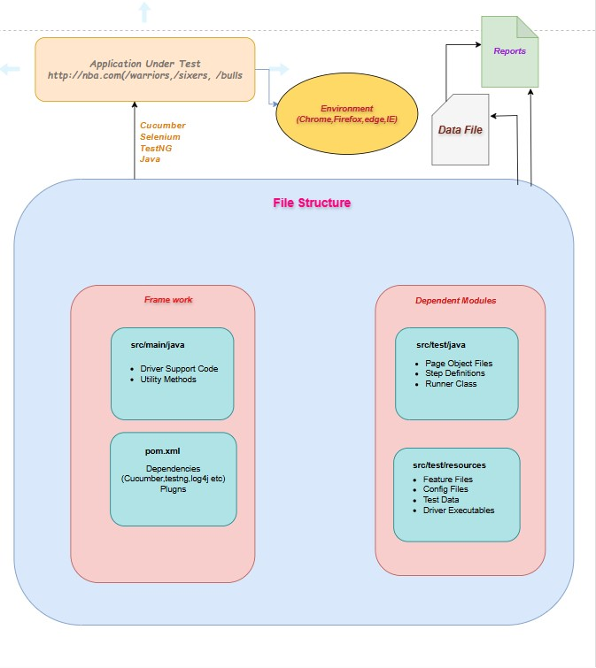

# Gopala's Test Assessment

Pre-Requisites:
•	JDK 22
•	Maven
•	Eclipse
o	Testng Plugin
o	Cucumber Plugin

**Framework Architecture**

**Steps to Execute Testcases:**
•	Executing testcases using mvn commands
  Run any of the following commands to execute the testcases : 
  •	mvn clean install (inside the folder GopalaVeevaTestAssessment)
  •	mvn test
  •	mvn test -Dcucumber.filter.tags=”@Smoke”

•	Execute using mvn from Eclipse
  o	Right click on ‘GopalaVeevaTestAssessment’ folder and click on ‘Run As’ followed by ‘Maven Build…”. Specify the goals as ‘clean install’.

•	Execute tests using Cucumber Runner class + TestNG

  o	In Eclipse, right click on the Runner class and click ‘Run As’, followed by TestNG

•	Execute tests using feature file
  o	In Eclipse, right click on feature file and click ‘Run As’, followed by ‘Cucumber Test’

**Features Used for Automation:**
  •	Testcase Automation for all 4 testcases
  •	Page Object Model
  •	Maven Multi Modules
    o	Core-product, derived-product1 and derived-product2 modules have dependency only on automation-framework
    o	Common functionality across modules, is only present in framework code
  •	Cucumber:
    o	Feature Files, Step Definitions, Runner Class
    o	Options
    o	Hooks
    o	Tags
  •	Reporting:
    o	TestNG Reports
    o	Cucumber Reports
  •	Execution on any browser (chrome, firefox, ie, edge)
  •	Usage of config files for identifying the browser, testurl, etc
  •	Usage of testdata files for data validation
  •	Usage of logger library (log4j) for efficient logging
  •	Usage of different waits:
    o	Implicit, Explicit, FluentWait
  •	Usage of Java Regular expressions
